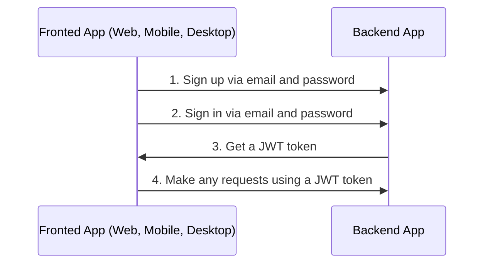
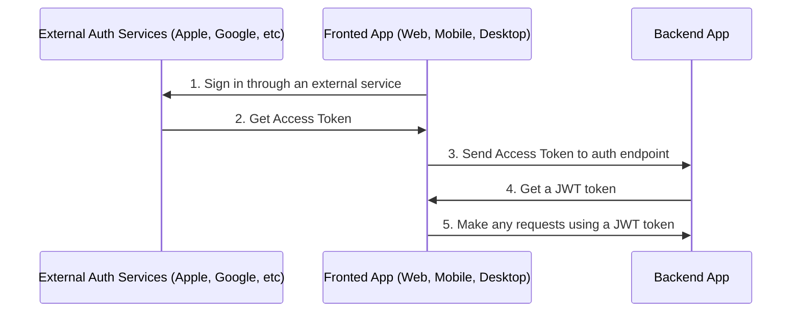

# Auth

By default boilerplate used sign in and sign up via email and password.



Also you can sign up via another external services or social networks like Apple and Google.



For auth with external services or social networks you need:

1. Sign in through an external service and get access token(s).
1. Call one of endpoints with access token received in frontend app on 1-st step and get JWT token from the backend app.

    ```text
    POST /api/v1/auth/google/login
    
    POST /api/v1/auth/apple/login
    ```

1. Make any requests using a JWT token

---

## Table of Contents

- [Configure Auth](#configure-auth)
- [Auth via Apple](#auth-via-apple)
- [Auth via Google](#auth-via-google)

---

## Configure Auth

1. Generate secret key

    ```bash
    node -e "console.log(require('crypto').randomBytes(256).toString('base64'));"
    ```

1. Go to `/.env` and change value in `AUTH_JWT_SECRET`

    ```text
    AUTH_JWT_SECRET=HERE_SECRET_KEY_FROM_STEP_1
    ```

## Auth via Apple

1. Set up your service on Apple
1. Change `APPLE_APP_AUDIENCE` in `.env`

    ```text
    APPLE_APP_AUDIENCE=["com.company", "com.company.web"]
    ```

## Auth via Google

1. Set up your service on Google
1. Change `GOOGLE_CLIENT_ID` and `GOOGLE_CLIENT_SECRET` in `.env`

    ```text
    GOOGLE_CLIENT_ID=abc
    GOOGLE_CLIENT_SECRET=abc
    ```

---

Next: [Serialization](serialization.md)

GitHub: https://github.com/brocoders/nestjs-boilerplate